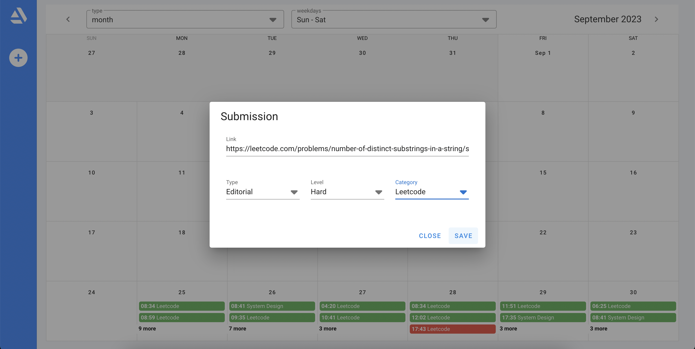
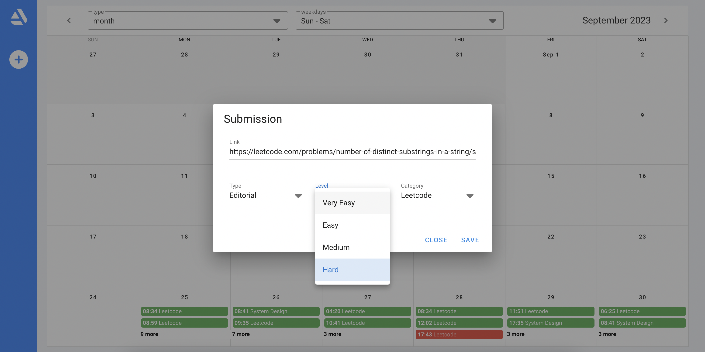
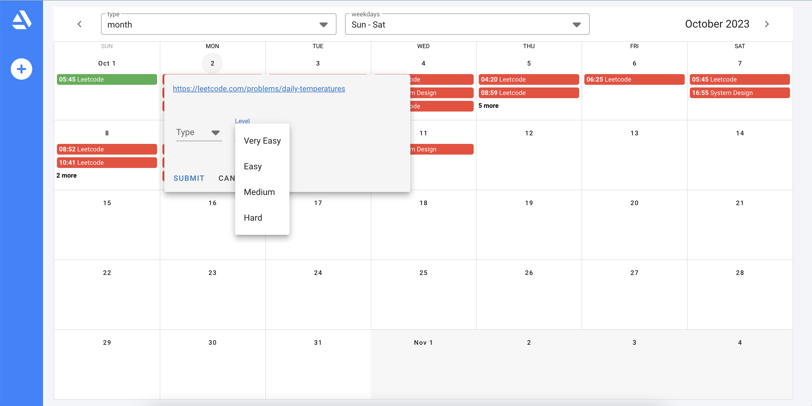

# Welcome to spaced-rept

Spaced Repetition is a revolutionary learning technique that optimizes your memory retention by strategically reviewing concepts at carefully spaced intervals. It's like leveling up your brain's coding superpowers!

- Learn a new concept, Solve a leetcode problem, Add the details here 
  

  
- Based on the combination you have choosen, next revision date will be updated for it automatically.
  

  
- work on it and update it to revise again and again
  

### Say Goodbye to Cramming

Tired of last-minute cramming sessions? spaced-rept helps you move away from cramming and embrace effective learning. We believe in spaced repetition, a proven technique to help you remember what you've learned for the long term.

### Never Forget Again

Have you ever experienced that "Aha!" moment when learning something new, only to forget it a few days later? With spaced-rept, you won't have to worry about forgetting valuable information. We'll remind you when it's time to revise, ensuring that knowledge sticks.

### Track and Measure Progress

Knowledge retention is a journey, and spaced-rept is your trusty companion. Track your progress, see how well you're retaining information, and identify areas that need more attention. Our intuitive dashboard provides insights into your learning journey.

### Spaced Repetition Scheduling

- Forget the hassle of manually tracking when to revise. spaced-rept intelligently schedules revision sessions based on proven spaced repetition algorithms.

### Progress Tracking

- Stay informed about your learning journey. See which concepts you've mastered and which ones need more attention.

## Get Started Today

Ready to supercharge your learning? Join spaced-rept and experience the power of spaced repetition. Say goodbye to cramming and hello to long-lasting knowledge.

## Steps to run this application

1. Docker is required for this to run
2. docker-compose up --build
3. Go to localhost:8080. Enjoy
4. docker-compose down 

